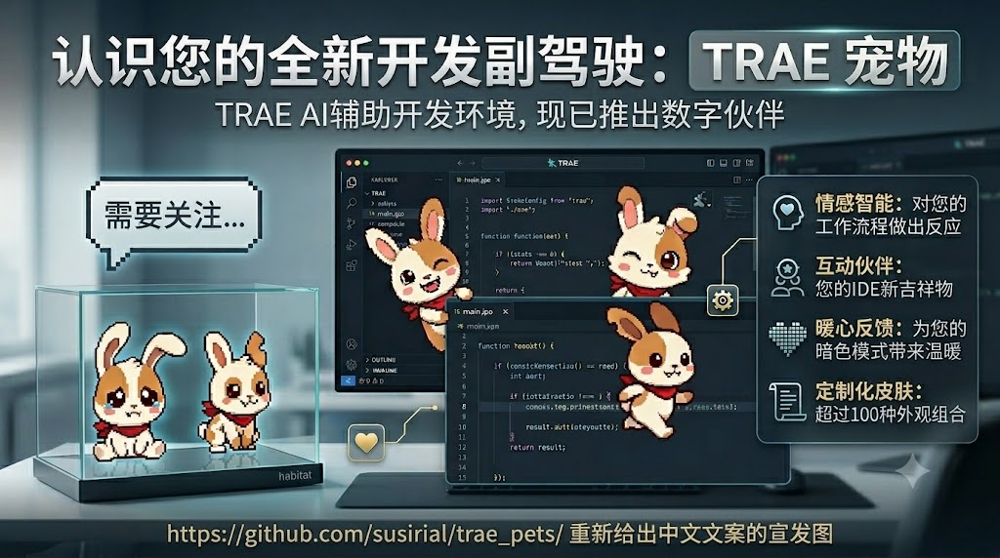

# TRAE Pet




> 把 TRAE 的 Hook 事件转成可视化桌宠反馈的 Electron 工具：在桌面实时展示“正在审阅 / 执行 / 完成 / 出错”等状态，并提供可视化配置界面，让开发者能用宠物包、提示气泡和自定义文案把 AI 编码过程变得可见、可配、可玩。

## 项目简介

`TRAE Pet` 是一个面向 TRAE 编码工作流的桌面电子宠物项目，核心目标是解决两个实际问题：

1. **AI 编码过程不可见**：TRAE 在调用工具、执行命令、修改文件时，用户很难从桌面侧快速感知当前进度与状态。
2. **反馈方式缺乏个性化**：默认日志或命令行输出不够直观，也无法根据个人偏好自定义动画、文案和提示风格。

本项目通过“**轻量 Hook CLI + 常驻 Electron 桌宠 + 可视化配置面板**”的组合，将 TRAE 的事件流映射成状态动画与提示文案。用户既可以直接使用内置宠物，也可以在设置页导入标准 Manifest v2 宠物包，或用九张标准状态图片快速制作自己的宠物。

## 核心功能模块

### 1. Hook 事件驱动的状态切换

- 读取 TRAE Hook 事件输入，识别 `SessionStart`、`UserPromptSubmit`、`PreToolUse`、`PostToolUse`、`Stop` 等场景。
- 根据工具类型、命令内容和执行结果，将事件映射为 `waving`、`review`、`waiting`、`happy`、`failed`、`idle` 等状态。
- 对命令执行、文件编辑、失败场景做了差异化处理，而不是简单地统一切状态。

### 2. 桌宠窗口与提示气泡

- 使用透明无边框 Electron 窗口渲染桌宠，支持置顶、拖动、右键菜单、托盘操作。
- 根据运行态实时切换 GIF，并在状态变化时弹出提示气泡。
- 对一次性动画使用版本号强制重挂载，确保单次播放状态能正确重播。

### 3. 可视化配置面板

- 编辑宠物名称、简介和桌面停靠位置。
- 为每个状态单独设置标题文案、消息文案、帧率、优先级、保持时长、提示色、播放方式和启用开关。
- 支持新增、删除自定义状态，并可直接在桌宠上触发预览。

### 4. 用户宠物库与快速制作

- 设置页“伙伴身份”提供用户宠物库，可导入标准 Manifest v2 ZIP 或文件夹，也可选择包含九张标准状态图片的目录快速制作。
- 安装前先在 staging 中预检，并展示九宫格预览、状态映射以及结构化错误和警告；快速制作会生成 canonical `trae.pet.manifest.v2`。
- 重复宠物 ID 会被拒绝并提示改名。用户包可删除；删除当前宠物会回退到内置 `trae`，并清理该宠物的 `petOverrides`。
- 临时预览会话有效期为 15 分钟，并在取消、安装或应用退出时清理。单文件上限 20 MiB、总包上限 100 MiB，同时拒绝符号链接和路径穿越。

### 5. 运行态与配置解耦

- CLI 不直接依赖 GUI，而是把运行态写入 `state.json`。
- Electron 主进程通过文件监听同步状态变化，实现 Hook 与桌宠的松耦合。
- 配置变更后会即时广播到窗口层，并在不重新触发事件的前提下刷新当前动画参数。

### 6. 隐私与历史记录控制

- 支持控制是否显示 prompt 文本、命令参数。
- 默认启用敏感信息裁剪，减少在提示文案中泄露上下文的风险。
- 可选写入 `history.jsonl` 保存状态历史，便于排查和回溯。

## 默认形象设计

`resources/default-emotions/` 内置了一套开箱即用的默认桌宠形象资源。该形象采用 **像素风兔子角色** 设计，整体特征是圆润、轻松、友好，配合红色围巾形成较强识别度，既有陪伴感，也足够适合作为开发场景中的状态反馈载体。

这套形象设计的目标不是单纯提供“可爱素材”，而是把 TRAE 的工作流状态翻译成开发者能一眼理解的桌面视觉语言：

- 待命时安静站立，强调“随时可开始”。
- 审阅与等待时动作克制，避免打扰，但能明确传达“正在处理中”。
- 奔跑、雀跃、完成等状态更活跃，强化任务推进和成功反馈。
- 失败状态通过坐姿和神态变化表达受阻，让异常更容易被注意到。

默认动作与状态映射如下：

| 状态 ID | 默认动图 | 设计意图 |
| --- | --- | --- |
| `idle` | 安静站立 | 表示系统空闲、等待下一次交互 |
| `waving` | 挥手欢迎 | 用于新会话开始，营造“搭档上线”的第一印象 |
| `running-right` | 向右奔跑 | 表示任务推进、进入处理流程 |
| `running-left` | 向左奔跑 | 表示流程折返、继续切换上下文 |
| `waiting` | 原地等待 | 对应命令执行或耗时操作中的持续等待 |
| `review` | 正面专注站立 | 对应审阅、读取、检查等偏观察型行为 |
| `jumping` | 轻快跃起 | 对应文件更新、阶段性变化完成后的即时反馈 |
| `happy` | 开心完成 | 用于成功结束、任务完成、结果正向反馈 |
| `failed` | 坐下受挫 | 用于错误、失败和异常场景提醒 |

这意味着即使用户不导入或制作宠物包，也能直接获得一套完整、连贯、具有人格感的默认体验；自制宠物仍沿用相同的九状态语义和交互结构。

## 工作原理

```text
TRAE Hook Event
        |
        v
bin/trae-pet(.cmd/.sh) -> bin/trae-pet.js -> dist/cli.cjs
        |                                       |
        | 解析事件 / 映射动作 / 生成提示         | 原子写入
        +-------------------------------------> state.json
                                                    |
                                                    | fs.watchFile
                                                    v
                                           Electron Main Process
                                                    |
                                 +------------------+------------------+
                                 |                                     |
                                 v                                     v
                          Pet Window (React)                    Settings Window (React)
```

## 技术栈清单

| 类别 | 方案 | 说明 |
| --- | --- | --- |
| 桌面应用框架 | Electron 42 | 常驻桌宠窗口、设置窗口、托盘、IPC、文件选择器 |
| 前端渲染 | React 19 | 桌宠界面与配置面板 |
| 构建工具 | electron-vite 5 | 主进程、预加载脚本、双页面渲染器构建 |
| 语言 | TypeScript 6 | 主进程、CLI、共享协议、前端统一类型约束 |
| CLI 打包 | tsup 8 | 将 Hook CLI 打成单文件 `dist/cli.cjs`，减小运行开销 |
| 安装打包 | electron-builder | 输出 macOS DMG、Windows NSIS、Linux AppImage/deb |
| 状态同步 | JSON 文件 + `fs.watchFile` | 用 `state.json` 连接 CLI 与 Electron |
| 资源策略 | 用户目录 + 内置资源目录 | 用户宠物包与内置宠物分离，兼顾可定制与可发布 |

## 快速上手

### 环境依赖

在本地开发或打包前，请先准备：

- Node.js 22/24 LTS（最低 `22.12.0`，推荐 Node 24 LTS）
- npm `9+`
- macOS、Windows 或 Linux
- 可用的 TRAE 环境（若需要接入 Hook）

> 项目当前未声明 CI 构建与覆盖率统计，因此上方徽章展示为 `not configured` / `not tracked`，与仓库现状保持一致。

### 1. 安装依赖

```bash
npm install
```

### 2. 启动开发模式

```bash
npm run dev
```

该命令会启动：

- Electron 主进程
- 桌宠窗口
- 配置窗口
- React 渲染层热更新

### 3. 编译 Hook CLI

TRAE 的 Hook 事件需要通过轻量 CLI 接入，因此首次接入前请先执行：

```bash
npm run build:cli
```

编译完成后会得到：

```text
dist/cli.cjs
```

跨平台启动入口位于：

- macOS: `bin/trae-pet.sh`
- Windows: `bin/trae-pet.cmd`

### 4. 详细配置 TRAE Hook

#### 推荐方式：自动接入

安装版应用每次启动都会自动接入本机全部已安装的 TRAE 版本（`~/.trae` 国际版、`~/.trae-cn` 国内版、`~/.trae-beta` 等），逐个备份并幂等合并各自的 `hooks.json`，不会动你已有的其他 Hook。接入状态可以在应用的“配置 → 检查”页查看，也可以从那里重新接入或移除接入。

从源码开发时，用 CLI 完成同样的事情：

```bash
npm run build:cli
node bin/trae-pet.js install-hooks
node bin/trae-pet.js verify-hooks
```

只想处理某一个版本时追加 `--profile=trae-cn`，或用 `--dir=<绝对路径>` 指定目录。

下面的手工流程用于理解原理和排障。第一次手工配置建议按顺序执行，不要跳步，这样更容易定位问题。

#### 第 1 步：先编译 Hook CLI

如果你还没执行过上一节的命令，先在项目根目录运行：

```bash
npm run build:cli
```

编译成功后，项目中应存在以下入口文件：

- macOS: `bin/trae-pet.sh`
- Windows: `bin/trae-pet.cmd`
- CLI bundle: `dist/cli.cjs`

如果这里还没准备好，TRAE 触发 Hook 时会直接报找不到 CLI。

#### 第 2 步：确保桌宠主程序已启动

Hook 负责写入运行态，桌宠窗口负责把状态展示出来。开发阶段建议直接运行：

```bash
npm run dev
```

如果你已经打好了桌面安装包，也可以直接启动安装后的应用。只要桌宠进程在运行，Hook 写入的状态就会被自动监听并刷新。

#### 第 3 步：先手动验证 Hook 命令本身可用

在真正修改 TRAE 配置前，先手动模拟一条 Hook 事件。这样可以先排除路径错误、执行权限错误、CLI 未编译等基础问题。

macOS / Linux:

```bash
echo '{"hook_event_name":"UserPromptSubmit","prompt":"hello"}' | "/absolute/path/to/trae-pet/bin/trae-pet.sh" hook
```

Windows:

```powershell
'{"hook_event_name":"UserPromptSubmit","prompt":"hello"}' | "C:\absolute\path\to\trae-pet\bin\trae-pet.cmd" hook
```

如果命令执行成功，你会看到一段 JSON 输出，类似：

```json
{"continue":true,"suppressOutput":true,"hookSpecificOutput":{"hookEventName":"UserPromptSubmit","additionalContext":"TRAE pet updated: action=review."}}
```

这说明 Hook CLI 已经可以正确读取事件并返回给 TRAE。

#### 第 4 步：找到 TRAE 的 Hook 配置文件

每个 TRAE 版本都有自己独立的配置文件：

- TRAE 国际版：`~/.trae/hooks.json`（Windows 为 `%USERPROFILE%\.trae\hooks.json`）
- TRAE 国内版：`~/.trae-cn/hooks.json`（Windows 为 `%USERPROFILE%\.trae-cn\hooks.json`）
- 其它变体：`~/.trae-<变体>/hooks.json`

你日常使用哪个版本，就要配置哪个版本；两边的配置不会互相同步。自动接入会一次性覆盖全部版本，这也是推荐做法。如果文件不存在，可以手动创建。如果文件已经存在，建议先备份，再把下面的配置合并进去，而不是盲目覆盖其他自定义规则。

#### 第 5 步：把 Hook 配置写入 `hooks.json`

最简单稳定的方式，是把 `hook` 子命令直接写进 `command` 字符串中，也就是：

```text
"/absolute/path/to/trae-pet/bin/trae-pet.sh" hook
```

不要把 `hook` 拆到别的字段里，避免不同版本的 Hook 运行器对参数传递行为不一致。

macOS / Linux 完整示例：

```json
{
  "hooks": {
    "SessionStart": [
      {
        "matcher": "*",
        "hooks": [
          {
            "type": "command",
            "command": "/absolute/path/to/trae-pet/bin/trae-pet.sh hook",
            "timeout": 10
          }
        ]
      }
    ],
    "SessionEnd": [
      {
        "matcher": "*",
        "hooks": [
          {
            "type": "command",
            "command": "/absolute/path/to/trae-pet/bin/trae-pet.sh hook",
            "timeout": 10
          }
        ]
      }
    ],
    "UserPromptSubmit": [
      {
        "matcher": "*",
        "hooks": [
          {
            "type": "command",
            "command": "/absolute/path/to/trae-pet/bin/trae-pet.sh hook",
            "timeout": 10
          }
        ]
      }
    ],
    "PreToolUse": [
      {
        "matcher": "*",
        "hooks": [
          {
            "type": "command",
            "command": "/absolute/path/to/trae-pet/bin/trae-pet.sh hook",
            "timeout": 10
          }
        ]
      }
    ],
    "PostToolUse": [
      {
        "matcher": "*",
        "hooks": [
          {
            "type": "command",
            "command": "/absolute/path/to/trae-pet/bin/trae-pet.sh hook",
            "timeout": 10
          }
        ]
      }
    ],
    "PostToolUseFailure": [
      {
        "matcher": "*",
        "hooks": [
          {
            "type": "command",
            "command": "/absolute/path/to/trae-pet/bin/trae-pet.sh hook",
            "timeout": 10
          }
        ]
      }
    ],
    "Stop": [
      {
        "matcher": "*",
        "hooks": [
          {
            "type": "command",
            "command": "/absolute/path/to/trae-pet/bin/trae-pet.sh hook",
            "timeout": 10
          }
        ]
      }
    ],
    "StopFailure": [
      {
        "matcher": "*",
        "hooks": [
          {
            "type": "command",
            "command": "/absolute/path/to/trae-pet/bin/trae-pet.sh hook",
            "timeout": 10
          }
        ]
      }
    ],
    "PreCompact": [
      {
        "matcher": "*",
        "hooks": [
          {
            "type": "command",
            "command": "/absolute/path/to/trae-pet/bin/trae-pet.sh hook",
            "timeout": 10
          }
        ]
      }
    ]
  }
}
```

Windows 只需要把 `command` 改成 `.cmd` 路径，例如：

```json
{
  "type": "command",
  "command": "C:\\absolute\\path\\to\\trae-pet\\bin\\trae-pet.cmd hook",
  "timeout": 10
}
```

这些事件的含义如下：

- `SessionStart`: 新会话开始
- `SessionEnd`: 会话结束
- `UserPromptSubmit`: 用户发送问题
- `PreToolUse`: 工具调用前
- `PostToolUse`: 工具调用成功后
- `PostToolUseFailure`: 工具调用失败后
- `Stop`: 本轮回复结束
- `StopFailure`: 停止流程失败
- `PreCompact`: 上下文压缩前

如果你只想先做最小验证，也可以只保留 `UserPromptSubmit`、`PreToolUse`、`PostToolUse`、`Stop` 四类事件，确认链路通了之后再补全其他事件。

#### 第 6 步：保存配置并重新触发一个新会话

保存 `hooks.json` 后，建议：

1. 回到 TRAE
2. 新开一个会话，或重新发送一条消息
3. 观察桌宠是否切换到 `review`、`waiting`、`happy`、`idle` 等状态

多数情况下不需要重装应用，但如果你长时间打开着同一个 TRAE 窗口，重新开一个新会话通常更稳妥。

#### 第 7 步：用 CLI 查看状态是否真的写入成功

如果桌宠没有变化，不要先怀疑渲染层，先直接查看 CLI 的运行态文件是否被更新：

```bash
node bin/trae-pet.js status
```

正常情况下你会看到类似输出：

```json
{
  "ok": true,
  "state": {
    "action": "review",
    "updatedAt": "2026-06-15T13:41:40.552Z"
  }
}
```

重点检查：

- `state.action` 是否随着 TRAE 操作而变化
- `updatedAt` 是否是最近时间
- `renderer` 是否处于运行状态

如果这里有变化，说明 Hook 已经打通，剩下的问题通常在桌宠主程序是否启动或界面是否被遮挡。

#### 第 8 步：排查常见问题

1. `CLI bundle not found`

说明还没有生成 `dist/cli.cjs`，重新执行：

```bash
npm run build:cli
```

2. TRAE 里有动作但桌宠没变化

先执行：

```bash
node bin/trae-pet.js status
```

如果状态在变，说明 Hook 正常，去检查桌宠程序是否已启动。

3. 保存了 `hooks.json` 但完全没有触发

优先检查：

- `command` 是否使用了绝对路径
- 路径末尾是否真的带了 `hook`
- macOS 下脚本是否有执行权限

必要时可以手动执行：

```bash
chmod +x bin/trae-pet.sh
```

4. 想看环境是否完整

可以执行：

```bash
node bin/trae-pet.js doctor
```

它会输出 Node 版本、平台、数据目录、资源目录、状态数量和渲染器状态，适合做快速自检。

#### Hook 输入来源说明

为了兼容不同的 Hook 运行方式，CLI 会按以下顺序读取事件：

1. 环境变量 `TRAE_PET_INPUT_JSON`
2. 命令行参数中可解析的 JSON
3. 标准输入 `stdin`

也就是说，只要 TRAE 能把事件 JSON 以这三种方式之一传进来，`trae-pet` 就能处理。

### 5. 预览构建产物

```bash
npm run build
npm start
```

其中：

- `npm run build:cli` 编译 Hook CLI
- `npm run build:app` 编译 Electron 主进程、预加载脚本和双页面渲染器
- `npm run build` 一次性完成全部构建

### 6. 打包安装程序

```bash
npm run package:mac
npm run package:win
npm run package:linux
```

Hook CLI 使用用户机器上受支持的系统 Node 22/24 LTS（最低 `22.12.0`，推荐
Node 24 LTS）；安装包不分发独立 Node runtime。使用 `nvm`/`fnm` 时应从能找到
Node 的终端运行发布包 launcher 的 `install-hooks`，它会固化 Node 绝对路径；
Node 升级、移动或卸载后需重跑 `install-hooks`。

在 MacBook 上组装官网三平台 ZIP：

```bash
npm run release:local
npm run release:verify
```

该流程在 macOS 原生分别构建 arm64（Apple Silicon）和 x64（Intel）DMG，并通过
Docker/Wine 构建 Windows x64 与 Linux x64。结果位于 `release/final/`。
`security-test` 渠道仅允许构建同时包含两种架构的 macOS 测试包；默认
`unsigned-preview` 与任何官网发布仍需按 `RELEASE_CHECKLIST.md` 完成对应平台验收。

`security-test` 会启用 native secure-core、发行 JS 混淆、生产 CSP/sandbox 和
Electron ASAR/Fuse 完整性门禁，并要求 Developer ID 签名、公证与 stapling。
这些措施提高逆向与篡改成本，但不应描述为“源码加密”或“绝对无法破解”。

生产安装与 AI 自动配置入口见 [`SETUP.md`](./SETUP.md)。

## 使用示例

### 启动、停止与查看状态

```bash
node bin/trae-pet.js start
node bin/trae-pet.js status
node bin/trae-pet.js stop
```

### 手动触发某个状态

```bash
node bin/trae-pet.js action happy
node bin/trae-pet.js action failed
node bin/trae-pet.js action custom-1
```

### 环境自检

```bash
node bin/trae-pet.js doctor
```

### Hook 模式

```bash
node bin/trae-pet.js hook
```

当通过 Hook 模式接收 TRAE 事件时，CLI 会：

1. 读取标准输入或环境变量中的事件 JSON。
2. 根据事件类型与结果选择动画状态。
3. 生成经过裁剪的提示文案。
4. 原子写入运行态文件，供 Electron 端监听并渲染。

## 默认状态与文案模板

项目内置 9 个基础状态：

- `idle`
- `waving`
- `running-right`
- `running-left`
- `waiting`
- `review`
- `jumping`
- `failed`
- `happy`

配置文案支持以下占位符：

- `{petName}`
- `{tool}`
- `{summary}`
- `{result}`
- `{event}`
- `{reason}`

## 点击互动

“宠物配置工作室”的“点击互动”区域支持为每个宠物选择包内 WebP 动作，并独立选择包内语音或公共音效。左键点击宠物时，动作与语音播放一次，随后恢复最新的 Hook/手动状态。

- 未覆盖动作时继承宠物包 Manifest 的 `interaction.clickAction`，也可对单个宠物禁用。
- 点击语音不会继承同名状态的音效，默认无语音。
- 连续点击会重新开始；新的 Hook 或手动状态始终优先。
- 点击使用内存中的瞬时展示层，不修改 `state.json`。

## 音频能力说明

桌宠支持为每个状态配置可选音频，当前版本遵循以下规则：

- 默认全局声音关闭；可在设置页的“声音”区域开启。
- 宠物包可以在 Manifest `sounds` 中携带专属音效，支持 MP3、WAV、OGG、M4A、AAC 和 FLAC。
- 公共音效库由两个目录合并而成：
  - 内置只读目录：`resources/sounds/`
  - 用户可写目录：`<userData>/sounds/`
- 公共库当前仅接受 `.mp3`。可在设置页导入，也可点击“打开目录”后复制文件并刷新。
- 每个宠物的每个动作都可选择：包默认、无声音、包内曲目或公共音效。
- 用户音效若仍被动作引用会拒绝删除；内置公共音效不可删除。
- 状态切换采用严格的 stop-and-replace：旧状态声音立即停止，新状态按配置接管。

## 数据目录与资源存放

运行态、配置文件、日志与用户宠物包默认写入用户目录，而不是安装目录：

| 平台 | 路径 |
| --- | --- |
| Windows | `%APPDATA%\trae-pet\` |
| macOS | `~/Library/Application Support/trae-pet/` |

目录中通常包含：

- `config.json`：用户配置
- `state.json`：当前运行态
- `history.jsonl`：状态历史记录
- `renderer.pid`：桌宠进程 PID
- `pets/`：用户导入的宠物包
- `sounds/`：用户公共 MP3 音效
- `logs/`：运行日志

## 项目结构

```text
bin/
  trae-pet.js            # CLI 启动器，自动查找 dist/cli.cjs 或打包后的 cli/cli.cjs
  trae-pet.sh            # macOS/Linux 包装脚本
  trae-pet.cmd           # Windows 包装脚本
resources/
  default-config.json    # 默认配置
  pets/                  # 内置 Manifest v2 宠物包
  sounds/                # 内置只读公共 MP3 音效
src/
  cli/                   # Hook 事件解析、动作映射、状态写入、CLI 命令
  app/
    main/                # Electron 主进程：窗口、托盘、IPC、配置读写、状态监听
    preload/             # contextBridge 暴露安全 API
    renderer/
      pet/               # 桌宠窗口
      settings/          # 配置窗口
  shared/                # 配置模型、状态协议、路径解析、IPC 常量
out/                     # Electron 构建产物
dist/                    # tsup 输出的 CLI 单文件产物
```

## 贡献指南

欢迎通过 Issue 或 Pull Request 参与改进。提交前建议至少完成以下检查：

```bash
npm install
npm run typecheck
npm run build
```

建议贡献流程：

1. 基于当前代码结构确认修改范围，尽量保持 `cli`、`app`、`shared` 的职责边界清晰。
2. 如果修改 Hook 行为，请同时检查事件映射、提示文案和状态优先级是否一致。
3. 如果修改配置模型，请同步确认默认配置、设置面板和运行态读取逻辑。
4. 提交 PR 时说明变更动机、影响范围和验证方式。

## 许可证信息

本项目以 [MIT License](./LICENSE) 授权。第三方组件继续适用各自许可证，见
[`THIRD_PARTY_NOTICES.txt`](./THIRD_PARTY_NOTICES.txt)。

## 平台接入文档

- [macOS 安装与接入](./INSTALL_MAC.md)
- [Windows 安装与接入](./INSTALL_WINDOWS.md)
- [Linux 安装与接入](./INSTALL_LINUX.md)
- [统一安装入口](./SETUP.md)
- [故障排查](./TROUBLESHOOTING.md)
